**Screenshots**

**Bat**
| Theme | Screenshot |
| --- | --- |
| Modus Operandi | 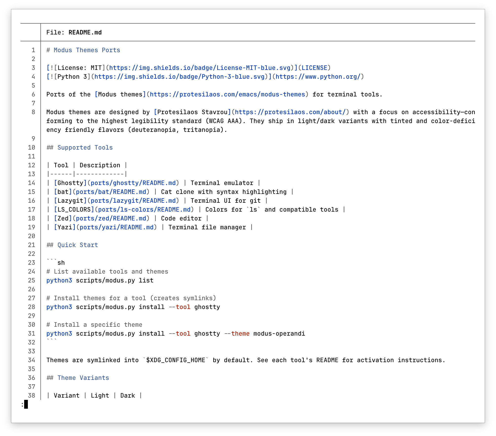 |
| Modus Operandi Tinted | 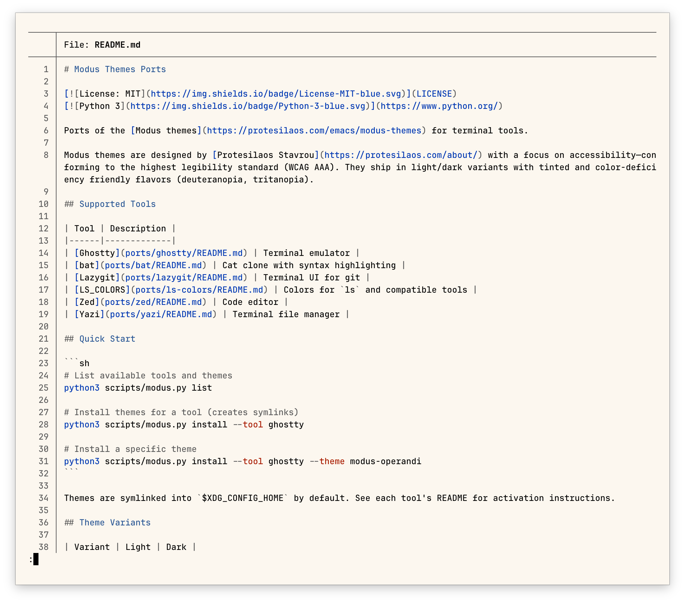 |
| Modus Vivendi | 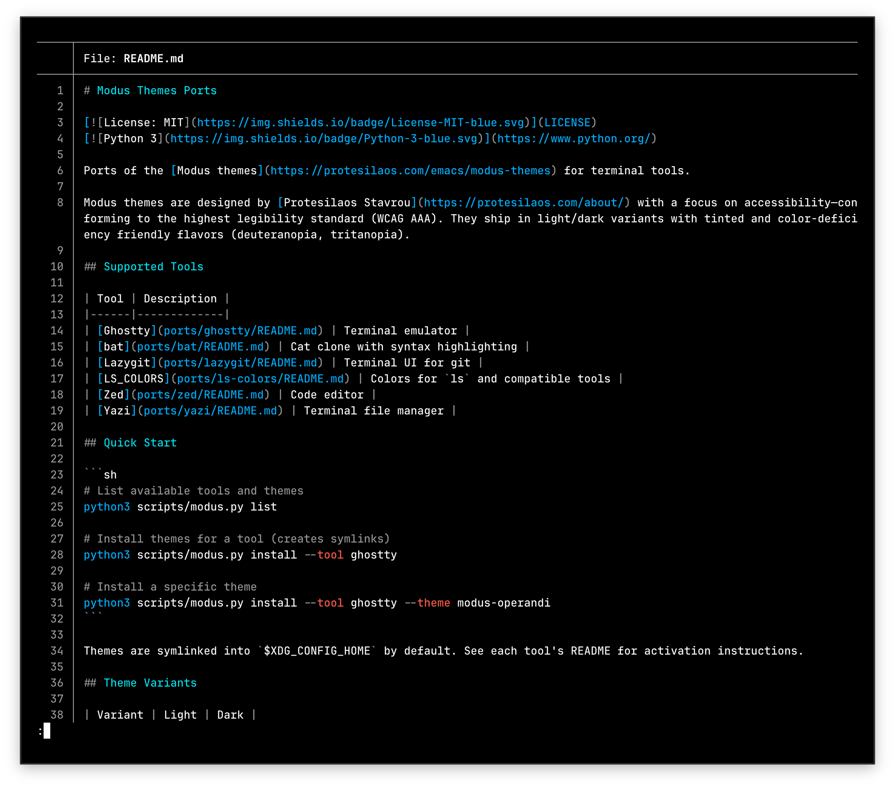 |
| Modus Vivendi Tinted | 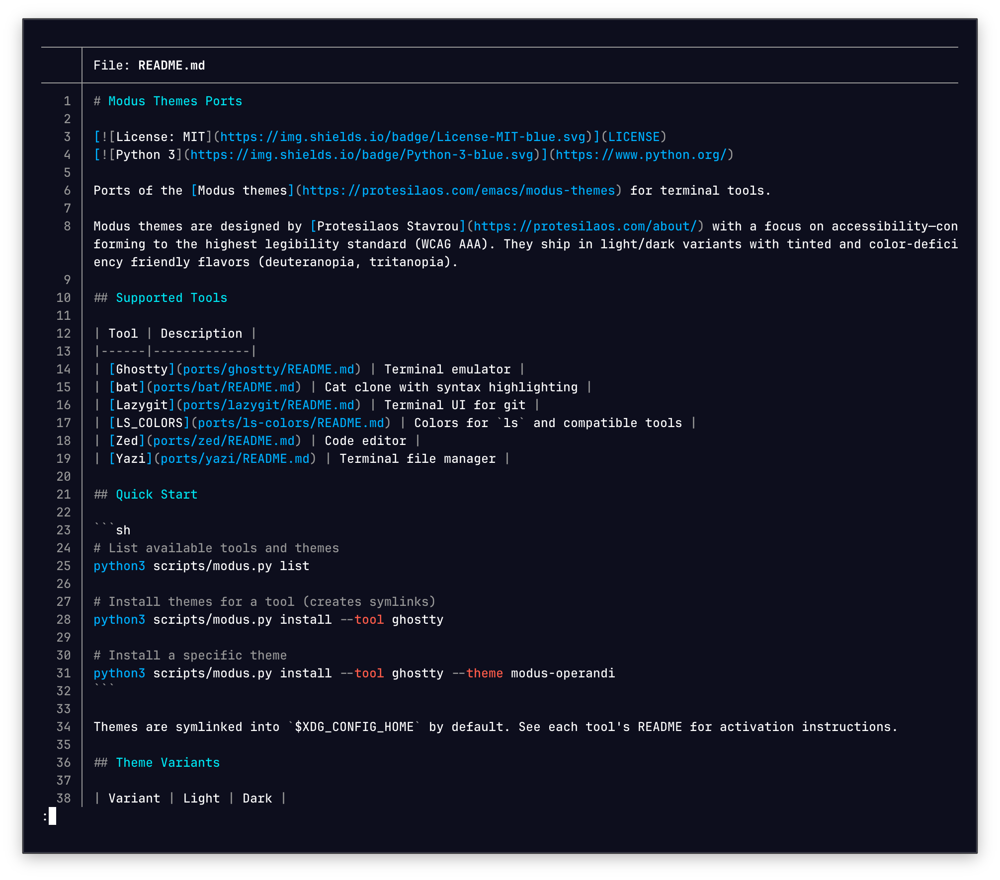 |

**Ghostty**
| Theme | Screenshot |
| --- | --- |
| Modus Operandi | 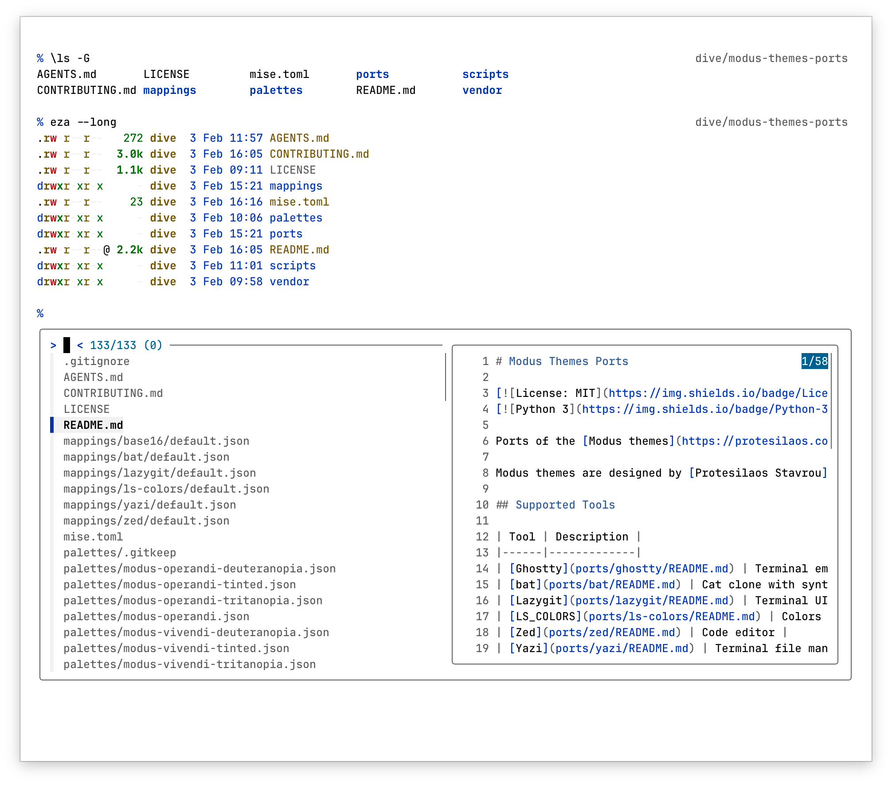 |
| Modus Operandi Tinted | 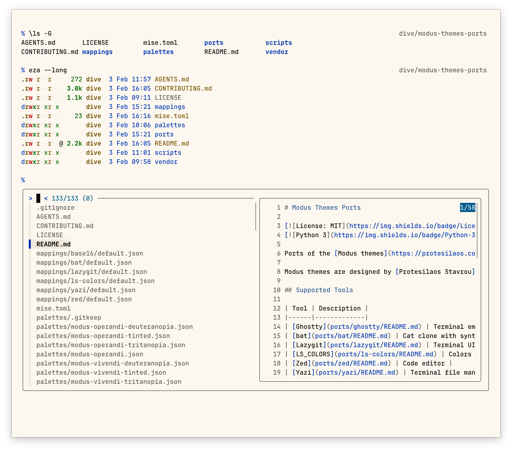 |
| Modus Vivendi | 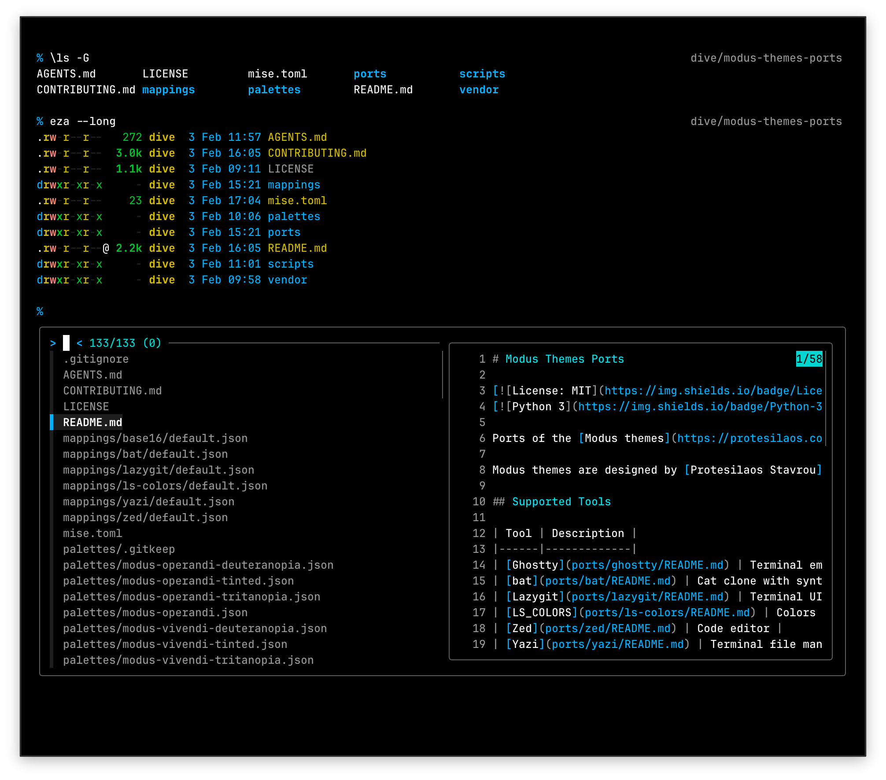 |
| Modus Vivendi Tinted | 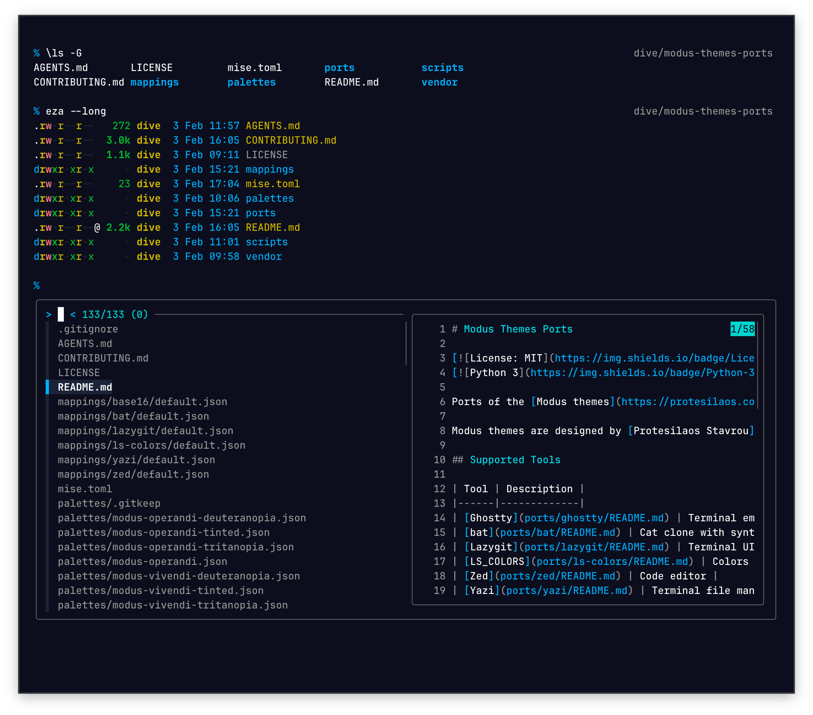 |

**Yazi**
| Theme | Screenshot |
| --- | --- |
| Modus Operandi | 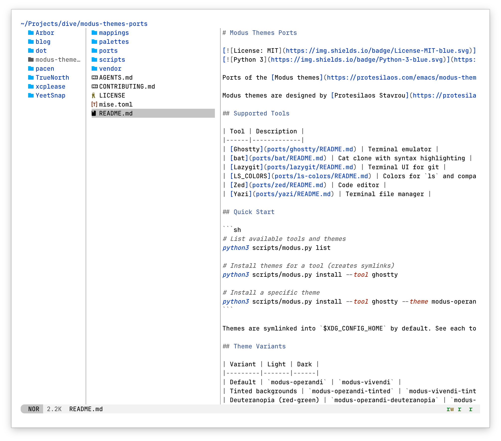 |
| Modus Operandi Tinted | 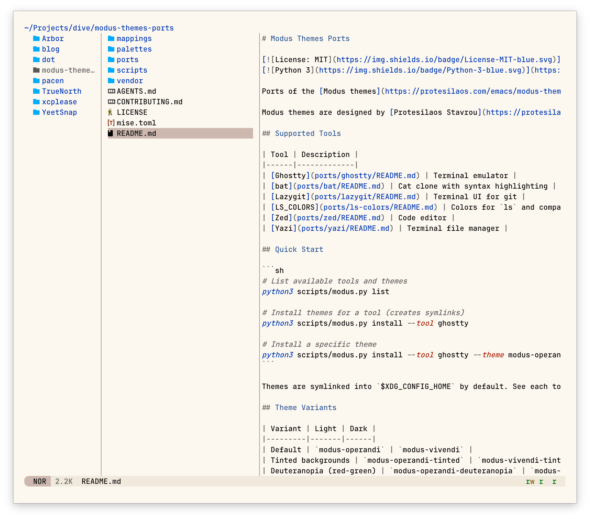 |
| Modus Vivendi | 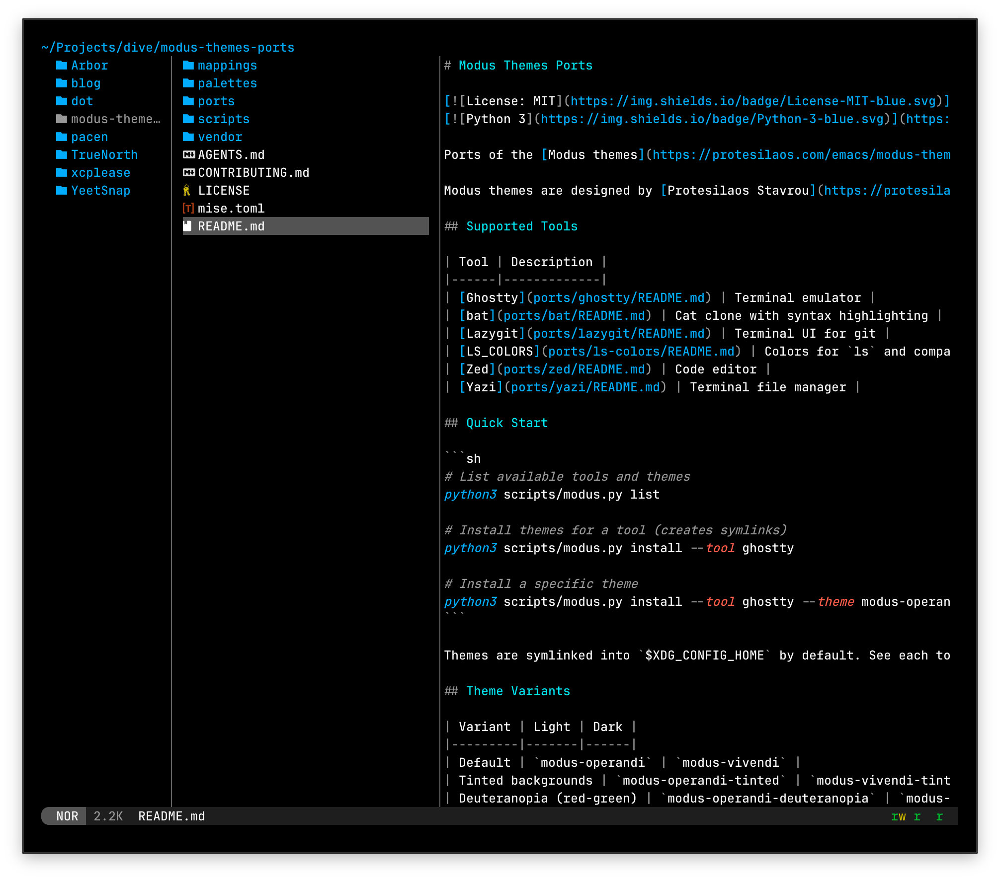 |
| Modus Vivendi Tinted |  |
