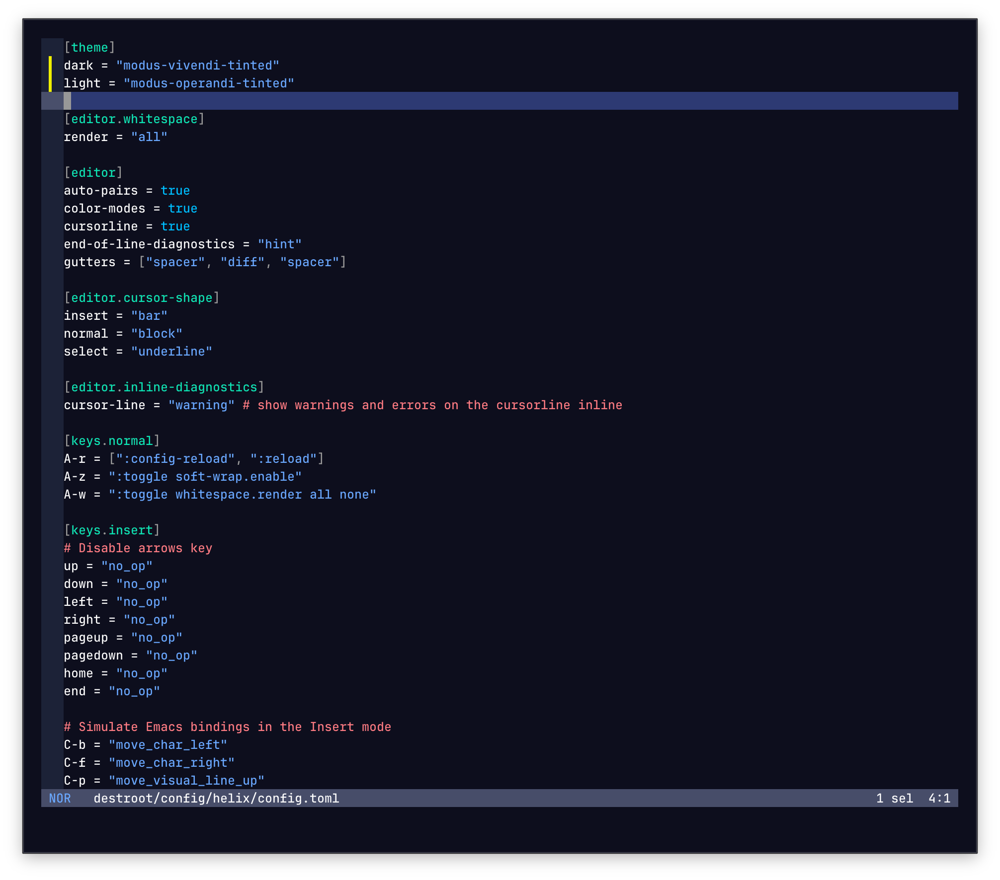
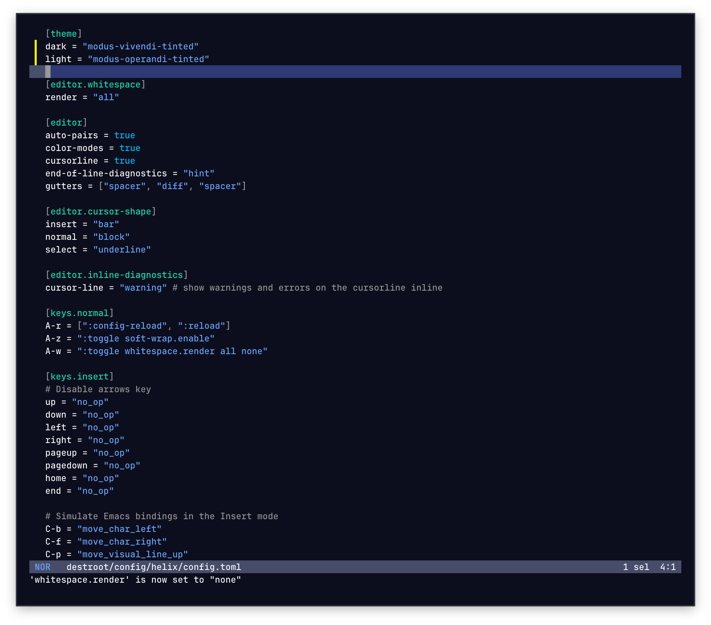

# Helix Themes

Modus Themes for the [Helix](https://helix-editor.com) editor.

> [!NOTE]
> Helix ships with built-in `modus_operandi` and `modus_vivendi` themes.
> This port provides an alternative with a cleaner gutter (no background color)
> and less distracting comments (grey instead of red).

| Built-in Helix Theme | This Port |
| --- | --- |
|  |  |

## Installation

Copy the theme files to `~/.config/helix/themes/`:

```sh
python3 scripts/modus.py install --tool helix
```

Or use symbolic links:

```sh
python3 scripts/modus.py install --tool helix --link
```

## Usage

Add to your `~/.config/helix/config.toml`:

```toml
theme = "modus-vivendi"
```

Available themes:
- `modus-operandi` — light theme
- `modus-operandi-tinted` — light theme with subtle tinted backgrounds
- `modus-operandi-deuteranopia` — light theme optimized for red-green color deficiency
- `modus-operandi-tritanopia` — light theme optimized for blue-yellow color deficiency
- `modus-vivendi` — dark theme
- `modus-vivendi-tinted` — dark theme with subtle tinted backgrounds
- `modus-vivendi-deuteranopia` — dark theme optimized for red-green color deficiency
- `modus-vivendi-tritanopia` — dark theme optimized for blue-yellow color deficiency

## Uninstall

```sh
python3 scripts/modus.py uninstall --tool helix
```
